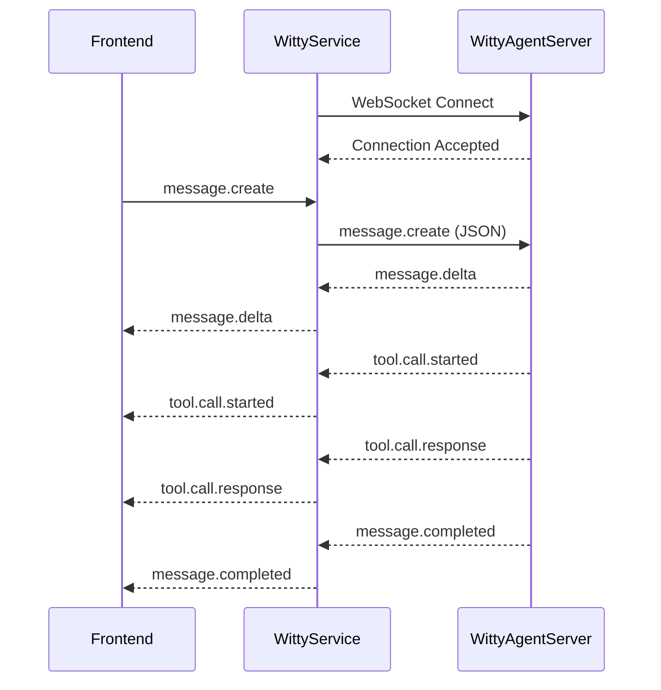

# Witty-Service WebSocket Adaptor 通信设计文档

- 日期：2026-04-09
- 版本：v2.1（部署视图刷新）
- 状态：已更新
- 对齐：witty-agent-server v2.2

## 1. 概述

### 1.1 目标

将 witty-service 与 adaptor service（witty-agent-server）之间的通信从 HTTP/SSE 改为纯 WebSocket，支持 `docker` / `local_process` / `e2b` 三种沙箱运行方式，并明确 witty-service、沙箱、witty-agent-server、runtime 的部署边界。

### 1.2 设计原则

| 原则 | 说明 |
|------|------|
| 纯 WebSocket | 移除 HTTP/SSE，所有消息通过 WebSocket 传输 |
| 客户端角色 | witty-service 作为 WebSocket 客户端，连接 adaptor service |
| 协议对齐 | 与 witty-agent-server v2.2 WebSocket 协议一致 |
| 事件归一化 | 归一化在 adaptor service 中完成，witty-service 接收统一格式 |
| 沙箱与 runtime 解耦 | `sandbox_type` 仅描述部署环境，`runtime_type` 由 witty-agent-server 内部适配 |
| 多 adaptor 实例支持 | 支持同时连接多个 witty-agent-server 实例（每个 agent 对应独立连接） |
| 无审批逻辑 | witty-service 仅透传消息，审批逻辑已在 witty-agent-server v2.2 中移除 |

### 1.3 关键变更（相对 v1.0）

1. 移除 `PolicyEngine` 相关引用
2. 移除所有 `approval.*` 事件类型
3. 入站消息简化：仅支持 `message.create`
4. 添加 OpenClaw 事件映射表

---

## 2. 架构设计

### 2.1 系统架构图

```mermaid
flowchart LR
    subgraph Client["Client / Frontend"]
        C["HTTP Client"]
    end

    subgraph WSVC["witty-service"]
        API["REST API"]
        AM["AgentManager + SessionManager"]
        SB["Sandbox Backend Router"]
        WSP["WebSocketClientPool"]
        API --> AM
        AM --> SB
        AM --> WSP
    end

    subgraph S1["Sandbox A（docker / local_process / e2b）"]
        AS1["witty-agent-server（1个实例）"]
        RT1["Runtime Adapter（openclaw/opencode/...）"]
        AS1 --> RT1
    end

    subgraph S2["Sandbox B（docker / local_process / e2b）"]
        AS2["witty-agent-server（1个实例）"]
        RT2["Runtime Adapter（openclaw/opencode/...）"]
        AS2 --> RT2
    end

    C -->|HTTP| API
    SB -->|为 agent 选择沙箱| S1
    SB -->|为 agent 选择沙箱| S2
    WSP <--> |WS /agent/sessions/{session_id}/ws| AS1
    WSP <--> |WS /agent/sessions/{session_id}/ws| AS2
```

### 2.2 消息流



### 2.3 部署视图关系（4层）

1. `witty-service` 负责 Agent 生命周期、会话管理、沙箱路由和 WS 转发。  
2. 每个沙箱内只运行一个 `witty-agent-server` 实例（单沙箱单 Agent + Adapter）。  
3. `witty-agent-server` 内部按 `runtime_type` 选择运行时适配器（`openclaw`、`opencode` 等）。  
4. 消息事件结构由 `witty-agent-server` 统一定义，`witty-service` 不改写 `tool.*` 事件语义。  

---

## 3. 组件设计

### 3.1 WebSocket 客户端接口

```python
# src/adapter/websocket_protocol.py

from typing import Any, TypedDict


class InboundEvent(TypedDict):
    """来自 adaptor service 的事件"""
    type: str
    session_id: str
    runtime_type: str
    event_id: str
    ts_ms: int
    payload: dict[str, Any]


class OutboundMessage(TypedDict, total=False):
    """发给 adaptor service 的消息"""
    type: str
    payload: dict[str, Any]


class WebSocketAdapterClient(Protocol):
    """WebSocket 适配器客户端接口"""

    @property
    def is_connected(self) -> bool:
        """检查连接状态"""
        ...

    async def connect(self, session_id: str) -> None:
        """连接到 adaptor service 的 WebSocket 端点"""
        ...

    async def disconnect(self) -> None:
        """断开连接"""
        ...

    async def send(self, message: OutboundMessage) -> None:
        """发送消息到 adaptor service"""
        ...

    async def recv(self) -> Iterator[InboundEvent]:
        """接收来自 adaptor service 的事件流"""
        ...

    async def close(self) -> None:
        """关闭连接"""
        ...
```

### 3.2 WebSocket 客户端池

```python
# src/adapter/websocket_client_pool.py

from dataclasses import dataclass
from typing import Callable


@dataclass(frozen=True)
class AdaptorEndpoint:
    """Adaptor 服务端点信息"""
    base_url: str          # ws://host:port
    session_id: str        # 当前会话 ID
    runtime_type: str      # openclaw / opencode


class WebSocketClientPool:
    """
    管理多个 WebSocket 客户端连接
    支持多个 adaptor service 实例
    """

    def __init__(self) -> None:
        self._clients: dict[str, WebSocketAdapterClient] = {}

    def get_client(
        self,
        agent_id: str,
        endpoint: AdaptorEndpoint,
        factory: Callable[[str], WebSocketAdapterClient],
    ) -> WebSocketAdapterClient:
        """获取或创建到特定 adaptor service 的 WebSocket 客户端"""
        ...

    def remove_client(self, agent_id: str) -> None:
        """移除指定 agent 的 WebSocket 客户端"""
        ...

    def close_all(self) -> None:
        """关闭所有客户端连接"""
        ...
```

### 3.3 RuntimeBackend 接口扩展

```python
# src/runtime/base.py (现有)

@dataclass(slots=True, frozen=True)
class AdapterEndpoint:
    base_url: str
    health_url: str | None = None
```

扩展添加 `ws_url` 属性：

```python
    @property
    def ws_url(self) -> str:
        """构建 WebSocket 连接 URL 模板"""
        if self.base_url.startswith("https"):
            scheme = "wss"
        else:
            scheme = "ws"
        host = self.base_url.split("://")[-1]
        return f"{scheme}://{host}/agent/sessions/{{session_id}}/ws"

    def ws_endpoint(self, session_id: str) -> str:
        """获取特定会话的 WebSocket URL"""
        if self.base_url.startswith("https"):
            scheme = "wss"
        else:
            scheme = "ws"
        host = self.base_url.split("://")[-1]
        return f"{scheme}://{host}/agent/sessions/{session_id}/ws"
```

### 3.4 AgentManager 集成

```python
# src/application/agent_manager.py (修改)

async def send_message(
    self,
    agent_id: str,
    session_id: str,
    content: str,
) -> list[dict[str, Any]]:
    # ... 现有验证逻辑 ...

    # 获取 WebSocket 客户端
    ws_client = self._ws_client_pool.get_client(
        agent_id=agent_id,
        endpoint=self._get_adaptor_endpoint(agent_id, session_id),
        factory=lambda url: WebSocketClient(base_url=url),
    )

    # 确保连接
    if not ws_client.is_connected:
        await ws_client.connect(session_id)

    # 发送消息
    await ws_client.send({
        "type": "message.create",
        "payload": {"message": content},
    })

    # 接收事件（迭代器）
    events = []
    async for event in ws_client.recv():
        events.append(event)
        if event["type"] == "message.completed":
            break

    return events

def _get_adaptor_endpoint(self, agent_id: str, session_id: str) -> AdaptorEndpoint:
    """获取 adaptor WebSocket 端点"""
    runtime_state = self._get_runtime_state(agent_id)
    base_url = runtime_state.adapter_base_url
    # http://host:port -> ws://host:port
    if base_url.startswith("https"):
        scheme = "wss"
    elif base_url.startswith("http"):
        scheme = "ws"
    else:
        scheme = "ws"
    host = base_url.split("://")[-1]
    ws_base_url = f"{scheme}://{host}"

    return AdaptorEndpoint(
        base_url=ws_base_url,
        session_id=session_id,
        runtime_type=self._get_agent(agent_id).runtime_type,
    )
```

---

## 4. 协议设计

与 witty-agent-server v2.2 保持一致。

### 4.1 入站消息（Client → Adaptor）

**仅支持 `message.create`**：

```json
{
  "type": "message.create",
  "payload": {
    "message": "帮我查一下最近的错误日志"
  }
}
```

> **注意**：v2.2 移除了 `approval.resolve` 等入站事件。witty-service 无需处理任何审批相关的消息。

### 4.2 出站事件（Adaptor → Client）

统一 envelope：

```json
{
  "type": "message.delta",
  "session_id": "session-id",
  "runtime_type": "openclaw",
  "event_id": "uuid-event-id",
  "ts_ms": 1712650000123,
  "payload": {}
}
```

### 4.3 事件类型

| type | 含义 | payload 关键字段 |
|------|------|------------------|
| `message.delta` | assistant 增量输出 | `delta` |
| `message.completed` | assistant 输出完成 | `text` |
| `tool.call.started` | 工具调用开始 | `tool_name`, `tool_call_id`, `arguments`, `stage` |
| `tool.call.response` | 工具结果 | `name`, `tool_call_id`, `content`, `is_error`, `stage` |
| `usage.updated` | 用量更新 | `input_tokens`, `output_tokens`, `total_cost` |
| `thinking` | 思考内容（可选） | `thinking`, `signature` |
| `session.runtime.changed` | runtime session 标识变化 | `runtime_session_id` 等 runtime 字段 |
| `stream.error` | 运行时流异常 | `code`, `message` |
| `client.error` | 客户端事件错误 | `code`, `message`, `details` |

### 4.4 OpenClaw 事件映射

| OpenClaw 原始事件 | 标准事件 | 说明 |
|------------------|----------|------|
| `agent(stream=assistant)` | `message.delta` | assistant 流式 token |
| `chat(state=final/error)` | `message.completed` | 一轮消息结束 |
| `session.message(delta)` | `message.delta` | session 维度增量 |
| `session.message(message)` | `usage.updated`/`tool.*`/`message.completed` | 从 message 内容抽取 |
| `session.tool` | `tool.call.started`/`tool.call.response` | 由 runtime 事件归一化后输出 |
| `session.usage` | `usage.updated` | 直接映射 |
| `sessions.changed` | `session.runtime.changed` | 运行时 session 标识更新 |

> **注意**：v2.2 移除了 `exec.approval.*` 事件的映射。runtime 层不再透传审批相关事件。

---

## 5. 沙箱与 Runtime 支持

### 5.1 沙箱类型（witty-service 负责）

| sandbox_type | 说明 | 支持状态 |
|--------------|------|----------|
| `local_process` | 本地进程启动 witty-agent-server | 现有支持 |
| `docker` | Docker 容器中运行 witty-agent-server | 现有支持 |
| `e2b` | E2B 云沙箱中运行 witty-agent-server | 目标支持（待补齐实现） |

### 5.2 Runtime 类型（witty-agent-server 负责）

| runtime_type | 说明 | 支持状态 |
|--------------|------|----------|
| `openclaw` | 当前默认 runtime | 现有支持 |
| `opencode` | 扩展 runtime | 规划支持 |

### 5.3 多实例连接

通过 `WebSocketClientPool` 支持同时连接多个 witty-agent-server 实例，每个 agent 拥有独立的 WebSocket 连接。

---

## 6. 移除 HTTP/SSE

### 6.1 需要移除的代码

1. **AdapterClient (HTTP)**：`src/adapter/client.py` - 整个文件移除
2. **SSE 相关**：`src/adapter/schemas.py` 中的 SSE 相关类型（`StreamEvent`, `StreamEventType`）
3. **send_message_stream 方法**：在 AgentManager 中的 SSE 流式处理逻辑

### 6.2 保留的接口

- `src/adapter/__init__.py` - 导出新的 WebSocket 客户端组件

---

## 7. 目录结构

```
witty-service/src/
├── adapter/
│   ├── __init__.py
│   ├── exceptions.py               # 创建：适配器异常类
│   ├── websocket_protocol.py       # 创建：协议类型定义
│   ├── websocket_client.py         # 创建：WebSocket 客户端实现
│   └── websocket_client_pool.py    # 创建：客户端连接池
├── application/
│   ├── agent_manager.py           # 修改：集成 WebSocket 客户端
│   └── session_manager.py
├── runtime/
│   ├── base.py                    # 修改：添加 ws_url 属性
│   ├── local_process.py
│   ├── docker.py
│   ├── e2b.py
│   └── factory.py
├── domain/
│   ├── models.py
│   └── enums.py
├── persistence/
│   └── repositories.py
├── api/
│   └── agents.py
└── main.py
```

---

## 8. 错误处理

### 8.1 连接错误

| 错误场景 | 处理策略 |
|----------|----------|
| 连接被拒绝 | 重试 3 次，间隔 1s/2s/4s 指数退避 |
| 连接超时 | 抛出 `AdaptorConnectionTimeout` |
| 连接断开 | 自动重连 |

### 8.2 消息错误

| 错误场景 | 处理策略 |
|----------|----------|
| 发送失败 | 抛出 `AdaptorSendFailed` |
| 接收失败 | 抛出 `AdaptorReceiveError` |
| 解析失败 | 记录错误，断开连接 |

### 8.3 异常类

```python
# src/adapter/exceptions.py

class AdaptorConnectionError(DomainError):
    """连接失败"""
    code = "ADAPTOR_CONNECTION_ERROR"

class AdaptorConnectionTimeout(DomainError):
    """连接超时"""
    code = "ADAPTOR_CONNECTION_TIMEOUT"

class AdaptorSendFailed(DomainError):
    """发送消息失败"""
    code = "ADAPTOR_SEND_FAILED"

class AdaptorReceiveError(DomainError):
    """接收消息失败"""
    code = "ADAPTOR_RECEIVE_ERROR"
```

---

## 9. 配置

### 9.1 环境变量

| 变量名 | 说明 | 默认值 |
|--------|------|--------|
| `WITTY_WS_CONNECT_TIMEOUT` | WebSocket 连接超时（秒） | 30 |
| `WITTY_WS_READ_TIMEOUT` | WebSocket 读取超时（秒） | 300 |
| `WITTY_WS_RETRY_ATTEMPTS` | 重试次数 | 3 |
| `WITTY_WS_RETRY_BASE_DELAY` | 重试基础延迟（秒） | 1 |

---

## 10. 实现计划

### 10.1 第一阶段：核心 WebSocket 客户端

1. 创建 `src/adapter/exceptions.py` - 定义异常类
2. 创建 `src/adapter/websocket_protocol.py` - 定义协议类型
3. 创建 `src/adapter/websocket_client.py` - 实现 WebSocket 客户端
4. 创建 `src/adapter/websocket_client_pool.py` - 实现连接池
5. 修改 `src/runtime/base.py` - 添加 ws_url 属性

### 10.2 第二阶段：集成 AgentManager

1. 修改 `src/application/agent_manager.py` - 替换 HTTP 客户端为 WebSocket 客户端
2. 修改 `src/api/services.py` - 依赖注入配置
3. 修改 `src/adapter/__init__.py` - 导出 WebSocket 组件

### 10.3 第三阶段：清理与测试

1. 移除 HTTP/SSE 相关代码（`client.py`, `schemas.py` 中的 SSE 类型）
2. 编写单元测试
3. 编写集成测试

---

## 11. 附录

### 11.1 参考文档

- [witty-agent-server 4+1 架构设计 (v2.2)](../../../witty-framework/docs/superpowers/specs/2026-04-09-witty-agent-server-4plus1-design.md)
- [agentd-service 详细设计](../agentd-service-design.md)

### 11.2 术语表

| 术语 | 说明 |
|------|------|
| Adaptor Service | 提供 Agent 运行时服务的组件（witty-agent-server） |
| WebSocket Client Pool | 管理多个 WebSocket 连接的管理器 |
| Runtime Backend | 启动和管理 adaptor service 运行时的后端 |

### 11.3 变更对齐清单（v2.0）

- [x] 移除 `PolicyEngine` 相关引用
- [x] 移除所有 `approval.*` 事件类型
- [x] 入站消息简化为仅 `message.create`
- [x] 添加 OpenClaw 事件映射表
- [x] 更新版本号和状态
